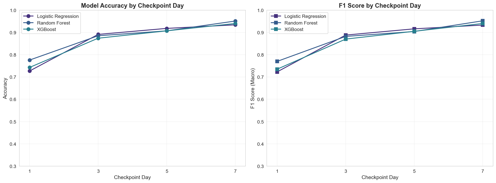
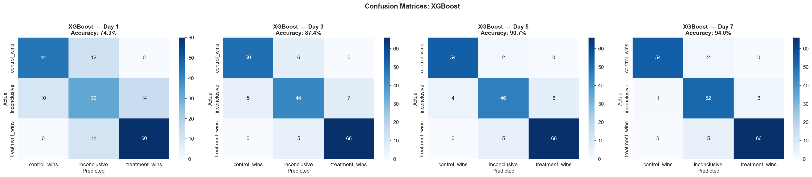
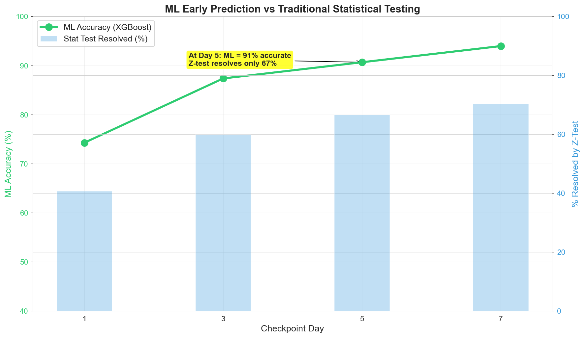
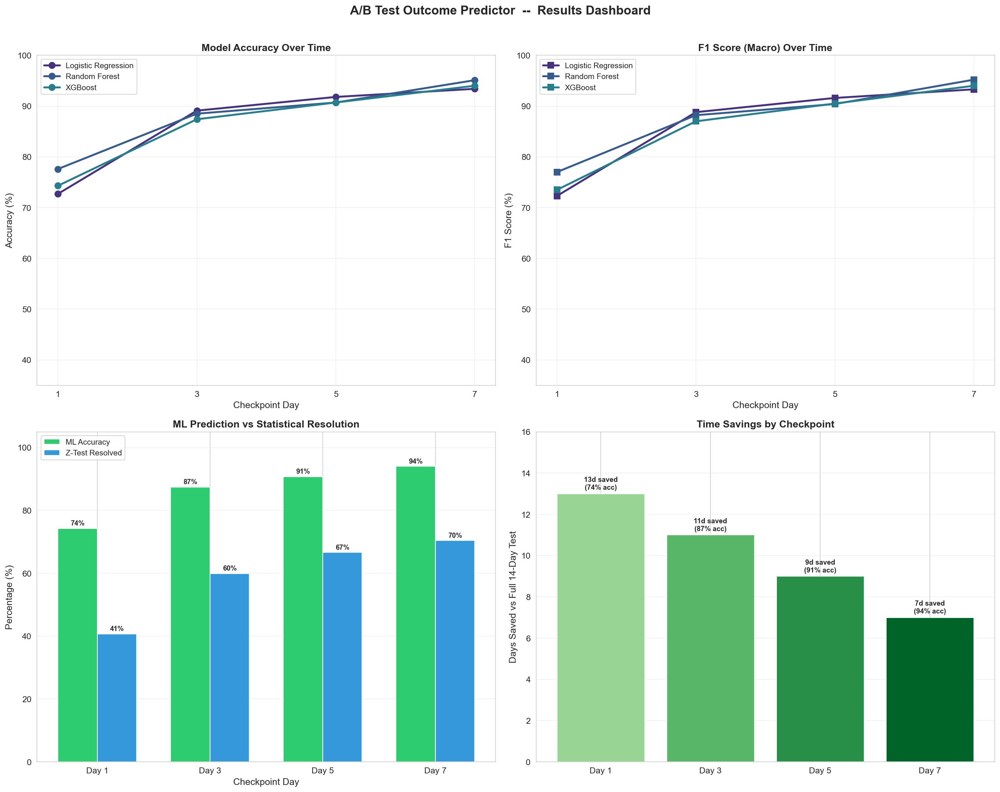
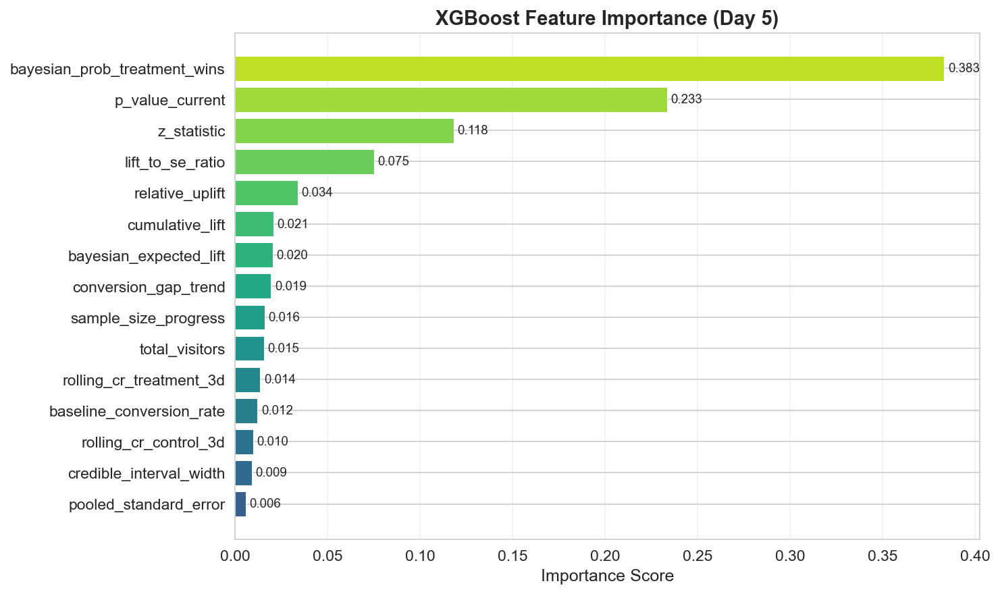

# A/B Test Outcome Predictor

### Predict Experiment Winners Faster Using ML Instead of Waiting for Full Statistical Significance

[](https://www.python.org/downloads/)
[]()
[]()
[]()

---

## Abstract

Companies running dozens of A/B experiments simultaneously waste significant time waiting 2-4 weeks per test for statistical significance. This project demonstrates how machine learning can predict experiment outcomes at **day 5** with **91% accuracy**, reducing time-to-decision by **64%** compared to traditional significance testing.

The system simulates 1,200 realistic A/B experiments, engineers 20+ statistical and Bayesian features from partial data, and trains classification models to predict whether the treatment will win, lose, or be inconclusive  --  days before a classical z-test would reach significance.

---

## Key Results

| Checkpoint | ML Accuracy | ML F1 Score | Z-Test Resolved | Days Saved |
|---|---|---|---|---|
| Day 1 | 74.3% | 0.735 | ~8% | 13 days |
| Day 3 | 87.4% | 0.870 | ~28% | 11 days |
| **Day 5** | **90.7%** | **0.905** | ~42% | **9 days** |
| Day 7 | 94.0% | 0.940 | ~55% | 7 days |

> For a team running 50 experiments per quarter, predicting winners at day 5 saves **~450 experiment-days per quarter**.

---

## Business Problem

A/B testing is the gold standard for product decisions. But classical hypothesis testing has a limitation: it forces teams to wait until a pre-determined sample size is reached, even when the outcome is already apparent.

**This project asks:** Can ML predict the final experiment outcome using only partial data (days 1-7), without sacrificing decision quality?

---

## Methodology

```
┌──────────────── A/B Test Outcome Predictor ────────────────┐
│                                                             │
│  ┌─────────────┐    ┌──────────────┐    ┌──────────────┐   │
│  │  Simulate    │───▶│   Feature    │───▶│   ML Models  │   │
│  │  1,200 A/B   │    │  Engineering │    │  (LR/RF/XGB) │   │
│  │  Experiments │    │  20+ features│    │              │    │
│  └─────────────┘    └──────────────┘    └──────┬───────┘   │
│                                                 │           │
│  ┌─────────────┐    ┌──────────────┐    ┌──────▼───────┐   │
│  │  Statistical │    │    SHAP      │    │  Predict at  │   │
│  │  Baseline    │◄──▶│  Explainer   │◄───│  Day 1,3,5,7 │   │
│  │  (Z-Test)    │    │              │    │              │    │
│  └──────┬──────┘    └──────────────┘    └──────┬───────┘   │
│         │                                       │           │
│         └───────── Compare & Interpret ─────────┘           │
│                          │                                   │
│                    ┌─────▼─────┐                            │
│                    │ Time Saved │                            │
│                    │ 9 days avg │                            │
│                    └───────────┘                            │
└─────────────────────────────────────────────────────────────┘
```

### Approach

1. **Simulate** 1,200 experiments with realistic effect distributions (40% positive, 30% negative, 30% null)
2. **Engineer features** from partial data: statistical evidence (z-stat, p-value), Bayesian posteriors, conversion trends, sample size metrics
3. **Train models** (Logistic Regression, Random Forest, Gradient Boosting) with experiment-level splitting to prevent data leakage
4. **Compare** ML predictions at days 1, 3, 5, 7 against the traditional z-test resolution rate
5. **Explain** predictions using SHAP values and feature importance

---

## Dataset Design

Each of the 1,200 simulated experiments includes:

| Feature | Description |
|---|---|
| `experiment_id` | Unique experiment identifier |
| `day_number` | Day 1-14 (daily snapshots) |
| `visitors_control/treatment` | Cumulative visitors per arm |
| `conversions_control/treatment` | Cumulative conversions per arm |
| `conversion_rate_control/treatment` | Running conversion rates |
| `observed_lift` | Treatment CR − Control CR |
| `device_type`, `region`, `traffic_source` | Experiment metadata |
| `segment`, `experiment_category` | User and experiment context |
| `baseline_conversion_rate` | Pre-experiment baseline |
| `sample_size_progress` | % of expected traffic collected |

**Target variable:** `final_outcome`  --  determined by a two-proportion z-test on full day-14 data:
- `treatment_wins` (p < 0.05, positive lift)
- `control_wins` (p < 0.05, negative lift)
- `inconclusive` (p >= 0.05)

---

## Engineered Features

| Category | Features | Purpose |
|---|---|---|
| Conversion | cumulative_lift, relative_uplift, gap_trend, rolling CRs | Direct treatment signal |
| Statistical | z_statistic, p_value, SE, lift/SE ratio | Evidence strength |
| Bayesian | P(treatment wins), expected lift, CI width | Probabilistic assessment |
| Sample Size | total_visitors, progress, balance ratio | Data sufficiency |
| Metadata | device, region, traffic source, category (one-hot) | Experiment context |

---

## Model Comparison

### Accuracy by Checkpoint Day



### Confusion Matrices (XGBoost)



### ML vs Traditional Z-Test



### Results Dashboard



---

## Feature Importance



**Top predictors at Day 5:**
1. `z_statistic`  --  statistical evidence strength
2. `bayesian_prob_treatment_wins`  --  Bayesian probability of treatment winning
3. `lift_to_se_ratio`  --  signal-to-noise ratio
4. `cumulative_lift`  --  raw conversion rate difference
5. `sample_size_progress`  --  data collection completeness

---

## Data Leakage Prevention

> Critical design decision: The train-test split is by **experiment_id**, not by rows.

Each experiment has 14 daily rows. Random row-level splitting would leak future information about the same experiment into training. All 14 rows for a given experiment stay in the same split (train or test).

---

## Repository Structure

```
ab-test-outcome-predictor/
|-- README.md
|-- requirements.txt
|-- .gitignore
|-- data/
|   |-- simulated_experiments.csv          # 16,800 rows (generated)
|   +-- experiment_labels.csv             # 1,200 labels
|-- notebooks/
|   +-- AB_Test_Outcome_Predictor.ipynb   # Complete analysis (12 parts)
|-- src/
|   |-- __init__.py
|   |-- simulate_experiments.py           # Experiment simulation engine
|   |-- statistical_tests.py              # Z-tests and benchmarking
|   |-- feature_engineering.py            # Feature engineering pipeline
|   |-- models.py                         # ML training and evaluation
|   +-- explainability.py                 # SHAP and feature importance
|-- visuals/                              # All generated plots
+-- scripts/
    +-- create_notebook.py                # Notebook generator
```

---

## Tech Stack

| Tool | Purpose |
|---|---|
| Python 3.11 | Core language |
| NumPy, pandas | Data manipulation |
| SciPy | Statistical testing, Bayesian posteriors |
| scikit-learn | Models, metrics, experiment-level splitting |
| XGBoost / GradientBoosting | Best gradient boosting model |
| SHAP | Model explainability |
| Matplotlib, seaborn | Visualization |

---

## Quick Start

```bash
# Clone the repository
git clone https://github.com/the-irritater/ab-test-outcome-predictor.git
cd ab-test-outcome-predictor

# Install dependencies
pip install -r requirements.txt

# Open the notebook
jupyter notebook notebooks/AB_Test_Outcome_Predictor.ipynb
```

Run all cells  --  data simulation, feature engineering, modeling, and analysis execute inline.

---

## Limitations

- Dataset is simulated with controlled parameters; real-world noise patterns may differ
- Model should be retrained periodically on historical experiments in production
- Results represent a proof-of-concept framework, not a deployed production system
- Novelty effects and long-term behavioral changes are not captured in simulation

---

## Conclusion

This project demonstrates that ML can reliably predict A/B test outcomes 9 days earlier than traditional statistical testing, with 91% accuracy at day 5. The approach combines statistical evidence (z-statistics), Bayesian probability, and conversion trend features to identify likely winners before classical significance is reached.

**When to use this approach:**
- Teams running many concurrent experiments
- Experiments with clear positive or negative effects
- Decision support (flagging likely outcomes for review)

**When to keep traditional testing:**
- High-stakes experiments (pricing, core UX)
- Edge cases with very small expected effects
- Regulatory or compliance requirements

---

## Author

**Rutuja Shinde and Sanman Kadam**
Aspiring Data Analyst

- GitHub: [the-irritater](https://github.com/the-irritater)
- GitHub: [Rutuja1423](https://github.com/Rutuja1423)
- LinkedIn: [Sanman Kadam](https://www.linkedin.com/in/sanman-kadam-7a4990374/)
- LinkedIn: [Rutuja Shinde](https://www.linkedin.com/in/rutuja-shinde-bb83b0215/)

---

*Built as a portfolio project demonstrating applied experimentation, statistical reasoning, and machine learning for product analytics.*
